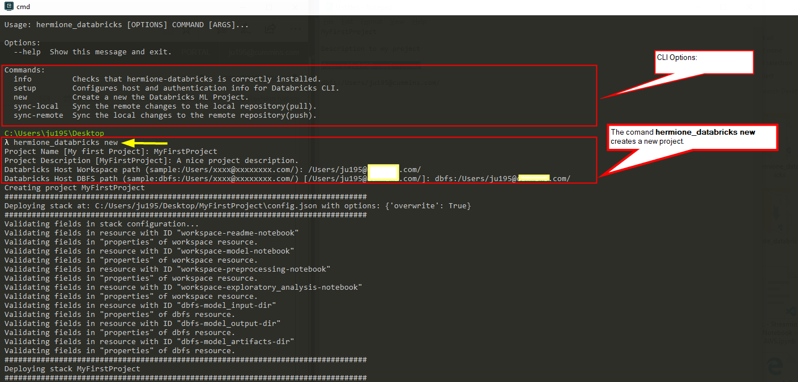

[](https://opensource.org/licenses/Apache-2.0)

## What is Databricks?
---
Azure Databricks is an Apache Spark-based analytics platform optimized for the Microsoft Azure/AWS cloud services platforms. Designed with the founders of Apache Spark, Databricks is integrated with Azure/AWS to provide one-click setup, streamlined workflows, and an interactive workspace that enables collaboration between data scientists, data engineers, and business analysts.
Databricks comprises the complete open-source Apache Spark cluster technologies and capabilities. Spark in Azure Databricks includes the following components:

**Spark SQL and DataFrames:** Spark SQL is the Spark module for working with structured data. A DataFrame is a distributed collection of data organized into named columns. It is conceptually equivalent to a table in a relational database or a data frame in R/Python.

**Streaming:** Real-time data processing and analysis for analytical and interactive applications. Integrates with HDFS, Flume, and Kafka.

**MLlib:** Machine Learning library consisting of common learning algorithms and utilities, including classification, regression, clustering, collaborative filtering, dimensionality reduction, as well as underlying optimization primitives.

**GraphX:** Graphs and graph computation for a broad scope of use cases from cognitive analytics to data exploration.

**Spark Core API:** Includes support for R, SQL, Python, Scala, and Java.

Reference:
 - https://github.com/databricks
 - https://azure.microsoft.com/en-us/services/databricks/
 - https://databricks.com/aws
---
## What is Hermione?

Hermione is the newest open source library that will help Data Scientists on setting up more organized codes, in a quicker and simpler way. Besides, there are some classes in Hermione which assist with daily tasks such as: column normalization and denormalization, data view, text vectoring, etc. Using Hermione, all you need is to execute a method and the rest is up to her, just like magic.

To bring in a little of **A3Data** experience, we work in Data Science teams inside several client companies and it’s undeniable the excellence of notebooks as a data exploration tool. Nevertheless, when it comes to data science products and their context, when the models needs to be consumed, monitored and have periodic maintenance, putting it into production inside a Jupyter Notebook is not the best choice (we are not even mentioning memory and CPU performance yet). And that’s why Hermione comes in! We have been inspired by this brilliant, empowered and awesome witch of The Harry Potter saga to name this framework!

This is also our way of reinforcing our position that women should be taking more leading roles in the technology field. **#CodeLikeAGirl**

Reference:
 - https://github.com/A3Data/hermione

## What is Hermione-Databricks?

Considering these two fantastic tools, we have bring the Hermione magic to the #databricks environment, considering more scalability through the #pyspark and #scala.

With  #hermione-databricks you will be able to create the entire structure for your ML project using the databricks workspace to structure the notebooks, pipelines and the DBFS(Databricks File System) to handle with large volumns of data.

Hermione-databricks is it fully 

When you start a new project with hermione-databricks, automatcly the bellow project structure is it created:
```
.workspace
├── project_name
|   ├── README.ipynb
|   ├── model
|   |   └── model.ipynb
|   ├── notebooks
|   |   └── exploratory_analysis.ipynb
|   ├── preprocessing
|   |   └── preprocessing.ipynb
dbfs:
└── project_name
|   └── model
|       ├── model.pkl
|       ├── input
|       ├── output
|       └── artifacts
```

Requirements
------------

-  Python Version >= 3.6

Installation
---------------

To install simply run
``pip install --upgrade hermione-databricks``


Then set up authentication using username/password or `authentication token <https://docs.databricks.com/api/latest/authentication.html#token-management>`_. Credentials are stored at ``~/.databrickscfg``.

- ``hermione-databricks databricks_config --token`` (enter hostname/auth-token at prompt)

To test that your authentication information is working, try a quick test like ``databricks workspace ls``.


## How do I use hermione-databricks?
After installed Hermione - Databricks:
0.  Configure the Databricks autentication :

```
hermione-databricks databricks_config --token
```
Here you need to specify the databricks host and the access token. 
The integration will be made using the official databricks-cli library.

1. Starting a new databricks project

```
hermione-databricks new-databricks-project
```
Here the hermione-databricks will prompt ask:
- **Project Name:** your project name;
- **Project Description:** Quicly project description;
- **Databricks Host Workspace path:** Databricks workspace path, location where your workspace objects will be saved
- **Databricks Host DBFS path:** Databricks DBFS path, location where your DBFS objects will be saved



## Contributing

  Make a pull request with your implementation.

For suggestions, contact us: igor.pereira.br@gmail.com

## Licence
Hermione-Databricks is open source and has Apache 2.0 License: [](https://opensource.org/licenses/Apache-2.0)